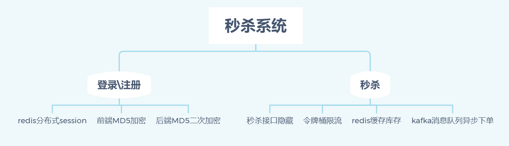

#### 一、简介

本项目是一个具备基本功能的秒杀系统，其中包含了登录、注册、秒杀等

#### 二、技术栈

| 技术         | 用处                                  |
| ------------ | ------------------------------------- |
| SpringBoot   | Java开发框架                          |
| Mybatis-plus | 数据库操作                            |
| MySQL        | 数据库                                |
| Redis        | 库存缓存、分布式session、用户频率统计 |
| Kafka        | 消息队列，用于异步下单                |

项目导入idea，配置mysql、redis、kafka即可启动

#### 三、项目流程相关知识

##### 项目要点



##### 项目流程

##### **注册、登录**：

###### **加密**

密码加密采用md5二次加密，即前端用固定盐进行一次加密（防止明文传输），传输到后端进行时间戳二次加密（防止数据库泄露，进一步加强安全性），并将密码和salt一起记录到数据库

###### 分布式session

采用redis存储session，生成uuid作为cookie的token值，每次请求就携带这个token取redis中查询相应的session。可直接使用spring-session无缝衔接tomcat的session，也可以手动利用redis存储值

其他的实现方式：

- **session复制**：将tomcat服务器的session复制到多个分布式上，通过更改tomcat配置达到
- **session粘滞**：在负载均衡时，通过把请求ip地址进行hash，以达到同一个请求一定是到达同一个服务器
- **cookie存储**
- **session集中管理**（上述方式）：比如采用redis集中存储session

##### 秒杀

###### 前端接口隐藏

每次请求都需要先向服务器获取一个hash值（保存在redis），然后再携带这个hash值请求接口。一定程度防止脚本直接刷接口。其中两次请求都需要验证是否到达秒杀时间

###### 接口令牌桶算法限流

**令牌桶算法**：桶每秒产生一定数量令牌（比如10），然后每个请求消耗一个令牌，如果没有令牌就等待或者直接失败；如果令牌达到桶的最大容量就溢出。

项目实现采用Guava工具类

```
//每秒生成10个令牌
RateLimiter rateLimiter = RateLimiter.create(10)
//非阻塞式尝试获取一个令牌失败
if(!rateLimiter.tryAcquire()){
    log.info("你被限制流了");
    return ResponseResult.error("你被限制流了");
}
```

###### 单用户频率限制

将用户访问的频率记录在redis中，如果短时间超过一定频率就直接返回失败。防止脚本刷单

###### redis缓存库存，减轻db压力

在启动时将商品库存读入redis，然后秒杀时查询库存并扣减库存，通过**lua脚本**实现原子操作

###### kafka消息队列异步下单

redis扣减库存后发送消息给kafka，然后mysql按照自己的能力去消费，实现mysql的查验、扣减库存并下单。

###### mysql事务悲观锁下单

mysql端还需要进行查询、扣减库存、下单的原子操作，采用事务保证原子性，查询用for update上锁


 

